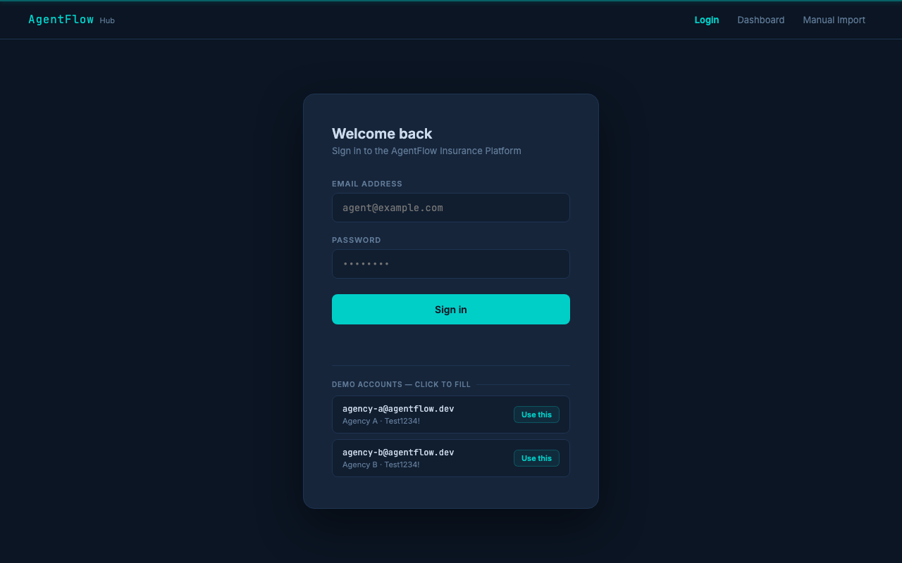
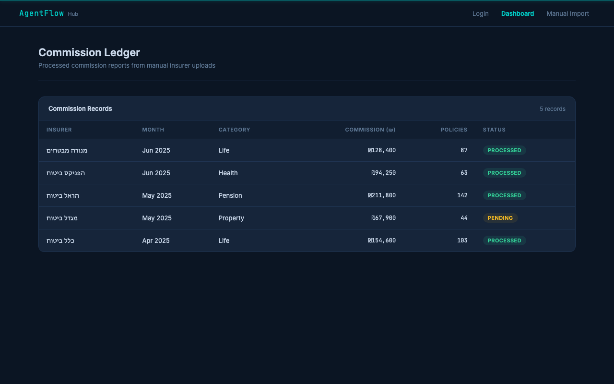
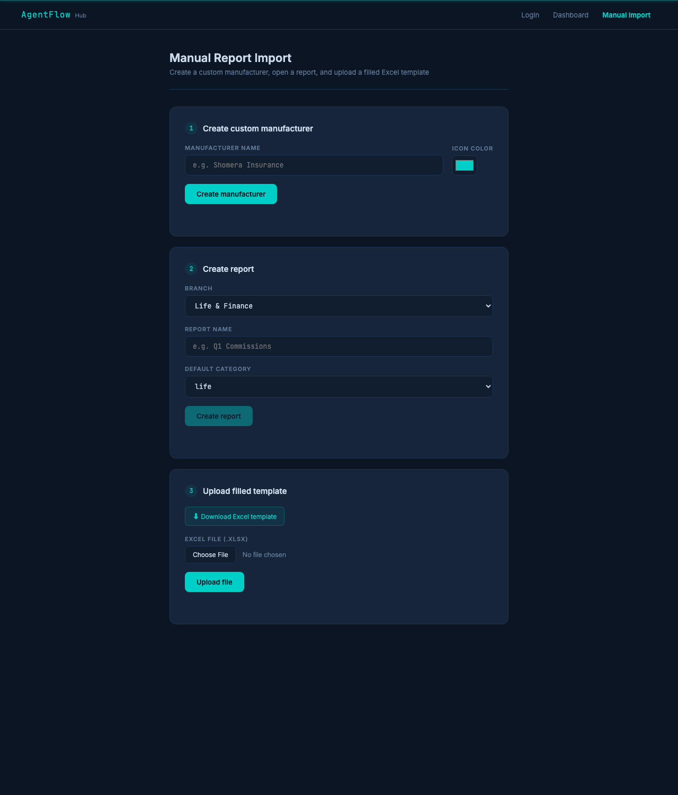

# AgentFlow Hub — QA Automation

End-to-end test suite for an insurance commission upload platform. Demonstrates the Testing Pyramid with mock-driven UI tests, API contract tests, and real-server integration tests.

| Login | Dashboard | Manual Import |
|---|---|---|
|  |  |  |

---

## Setup

**Prerequisites:** Node.js 18+

```bash
git clone https://github.com/mayageva11/AgentFlow
cd AgentFlow
npm install
npx playwright install chromium
npm run generate:fixtures
```

---

## Run the app locally

```bash
npm run server
```

Open your browser at:

| Page | URL |
|---|---|
| Login | http://localhost:4000/login |
| Dashboard | http://localhost:4000/dashboard |
| Manual Import | http://localhost:4000/import |

**Demo credentials** (click either row on the login page to auto-fill):

| Account | Email | Password |
|---|---|---|
| Agency A | `agency-a@agentflow.dev` | `Test1234!` |
| Agency B | `agency-b@agentflow.dev` | `Test1234!` |

The dashboard shows 5 sample commission records immediately. After uploading a file via the API, it shows real data.

---

## Run the tests

The server starts automatically when you run tests — no need to run `npm run server` separately.

```bash
npm test
```

View the HTML report:

```bash
npm run test:report
```

View the Allure report:

```bash
npx allure generate allure-results -o allure-report --clean
npx allure open allure-report
```

---

## What the tests cover

The suite has three layers, each proving a different skill:

1. **Mock-driven tests** intercept API calls with `page.route()` and inject controlled JSON from `tests/mockData.json` — fully deterministic, would run unchanged against the real Aigent API.
2. **Integration tests** hit the running Express server with real HTTP requests and the actual XLSX fixture files — the server's validators, status codes, and SHA-256 duplicate detection are exercised for real.
3. **A true UI end-to-end flow** clicks through the Manual Import page against the real server, exactly as a user would.

`globalSetup` calls `POST /api/reset` before the suite starts; `globalTeardown` calls it again after. This wipes all in-memory state (manufacturers, reports, commission records, duplicate-hash registry) so the suite is safe to run any number of times.

### E2E UI tests (`tests/e2e/`)

| File | Approach | What it checks |
|---|---|---|
| `manualImport.e2e.spec.ts` | **real server, no mocks** | True assignment flow through the UI: create manufacturer → create report → upload template (status 50) → record visible on dashboard · Empty file shows status 61 error |
| `fullFlow.e2e.spec.ts` | mocked via `page.route()` | Same flow with controlled responses: success (50) renders record · rejections (67, 70) leave dashboard empty |
| `dashboard.ui.spec.ts` | mocked via `page.route()` | Dashboard renders injected rows · Error state on 500 · Agency B data does not leak into Agency A view |
| `responsive.spec.ts` | mocked via `page.route()` | Login + Dashboard fit on Mobile Safari · Tablet Chrome · Desktop Chrome |

### API contract tests (`tests/api/`) — mocked

These test each API's contract via `page.evaluate()` (so `page.route()` intercepts the calls) and verify the exact response shape from `mockData.json`.

| File | What it checks |
|---|---|
| `upload.api.spec.ts` | Status 50 (valid) · 61 (empty) · 67 (bad format / all-or-nothing / invalid category) · 70 (bad month) · Duplicate detection |
| `manufacturer.api.spec.ts` | Create returns `MFR-` ID · Unknown ID returns 404 |
| `report.api.spec.ts` | Create returns `RPT-` ID · Foreign manufacturer returns 403 |
| `isolation.api.spec.ts` | Agency B cannot read Agency A manufacturer · Agency B cannot create report for Agency A manufacturer |

### Integration tests (`tests/integration/`) — real server

Real multipart uploads of the generated XLSX fixtures; nothing is intercepted.

| File | What it checks |
|---|---|
| `upload.integration.spec.ts` | Real status codes for every fixture: 50 · 61 · 67 (missing field) · 67 (all-or-nothing) · 67 (invalid category) · 70 · Real SHA-256 duplicate rejection · Template XLSX has exactly `month, policy_id, category` headers |
| `auth.integration.spec.ts` | Wrong password → 401 with no session cookie |

**38 tests across 4 projects:** Desktop Chrome · Mobile Safari · Tablet Chrome · Data Isolation Security

---

## Assumptions

- Tenant identity comes from an httpOnly session cookie set at login — `agencyId` is never read from the request body.
- Only three Excel columns exist (`month`, `policy_id`, `category`). Extra columns in an uploaded file are silently ignored (no status 67).
- Month validation is strict: only `MM-YYYY` is accepted. Any other format (e.g. `YYYY-MM`, `M-YYYY`) returns status 70.
- Duplicate detection is byte-level SHA-256 hashing. Two files with identical data but generated separately are treated as two distinct uploads.
- Session cookies are in-memory only — restarting the server logs everyone out.
- The dashboard shows records for the logged-in agency only. There is no cross-agency view.
- The Excel template (`GET /api/upload/template`) is downloadable from the Manual Import page; an integration test verifies it contains exactly the three required column headers.

---

## How the assignment flow works

1. **POST `/api/manufacturer`** — register a custom insurer with name + icon color
2. **POST `/api/report`** — create a commission report (branch: Life & Finance / Elementary / Travel, category: life / health / pension / property)
3. **POST `/api/upload`** — upload an XLSX file with columns `month`, `policy_id`, `category`
   - Month must be `MM-YYYY` format → otherwise status `70`
   - File must have at least one data row → otherwise status `61`
   - All rows must be valid → one bad row rejects the whole file (status `67`)
   - Same file uploaded twice → rejected as duplicate (status `67`)
   - All valid → status `50`, data appears in dashboard

---

## Project structure

```
src/
  server/
    index.ts              Express app — routes + session auth
    routes/
      upload.ts           XLSX validation, status codes, duplicate detection
      manufacturer.ts     Manufacturer CRUD
      report.ts           Report CRUD
    validators/           fileValidator, rowValidator, monthValidator
    state.ts              In-memory store (manufacturers, reports, uploads)
  pages/
    login.html            Login page with demo credential cards
    dashboard.html        Commission ledger — fetches /api/dashboard
    import.html           Manual Import — manufacturer, report, template upload

tests/
  api/                    Mock-driven API contract tests
    upload.api.spec.ts    Status code + business rule tests
    manufacturer.api.spec.ts
    report.api.spec.ts
    isolation.api.spec.ts Multi-tenant security tests
  integration/            Real-server tests — actual XLSX uploads, no mocks
    upload.integration.spec.ts
    auth.integration.spec.ts
  e2e/
    manualImport.e2e.spec.ts  True UI flow against real server
    fullFlow.e2e.spec.ts      Mocked assignment flow
    dashboard.ui.spec.ts      Mock-driven dashboard rendering tests
    responsive.spec.ts        Viewport tests (Mobile Safari, Tablet Chrome)
  pages/
    LoginPage.ts          POM — data-testid locators
    DashboardPage.ts      POM — data-testid locators
    ImportPage.ts         POM — data-testid locators
  fixtures/
    testBase.ts           Custom test fixture with DI page objects
  helpers/                manufacturerHelper, reportHelper, uploadHelper
  global-setup.ts         Resets server state + pre-authenticates both agencies
  global-teardown.ts      Resets server state after the run

fixtures/                 Generated XLSX files (9 files)
scripts/
  generateFixtures.ts     Generates all XLSX test fixtures
docs/
  test-plan.md            P0/P1/P2 scenario inventory
```

---

## CI (GitHub Actions)

Every push to `main` runs the full test suite and uploads the Allure report as an artifact. No deployment — tests only.

```
push to main → install → generate fixtures → run 38 tests → allure report → upload artifact
```

Download the Allure report from the Actions tab → latest run → Artifacts → `allure-report`.

---

## Tech stack

| Tool | Role |
|---|---|
| **Playwright** | Browser automation, API testing, network mocking, multi-project runner |
| **TypeScript** | End-to-end type safety across server, tests, and scripts |
| **Express.js** | Mock insurance platform API |
| **XLSX** | Fixture generation and server-side file parsing |
| **Allure** | Test report generation |
| **GitHub Actions** | CI — runs tests on every push |
| **Claude Code** | AI coding assistant used to build and iterate on this project |
